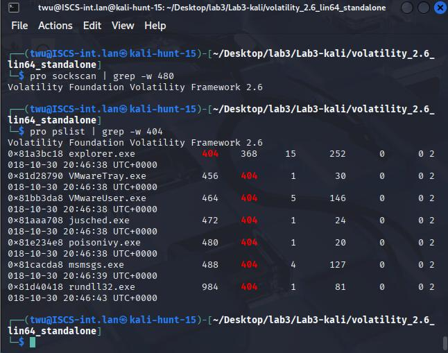

# Poison Ivy Memory Forensics Investigation

Volatility 2.6 investigation correlating process ancestry, executable paths, DLLs, file objects, and network artifacts in a Windows XP memory image.

**Author:** [Tenny Wu](https://github.com/714tenny)  
**Project type:** Academic lab / historical case study  
**Status:** Source work documented; scope and validation limits recorded below

## Context

Completed academic investigation of the supplied `KobayashiMaru.vmem` image. Commands are historical Volatility 2 examples for this legacy image.

## Tools

Volatility 2.6, Kali Linux, strings, Linux command-line tools, SimSpace

## Key results

- Analyzed an approximately 512 MB Windows XP x86 memory image using `WinXPSP2x86`.
- Identified `poisonivy.exe` PID 480 with parent `Explorer.EXE` PID 404.
- Correlated DLL, command-line, file-object, and scanned TCP artifacts with the same process.
- Recognized credential exposure in RAM; the recovered password and its screenshot are excluded from this repository.

## Documentation

- [Investigation notes](docs/investigation.md)
- [Sources and screenshot index](docs/source-and-evidence.md)
- [Commands](docs/commands.md)
- [Recorded indicators](indicators/observations.csv)

## Evidence preview

See the [evidence index](docs/source-and-evidence.md) for source-page references and the limits of each observation.

## Skills demonstrated

Memory forensics, profile selection, process ancestry, DLL analysis, path correlation, legacy network artifacts, credential-exposure handling.

## Evidence boundaries

This repository presents authorized coursework and its recorded evidence. It does not represent a live production incident, newly validated remediation, or a deployed security product. Conclusions, uncertainties, and source discrepancies are documented in the investigation notes.
